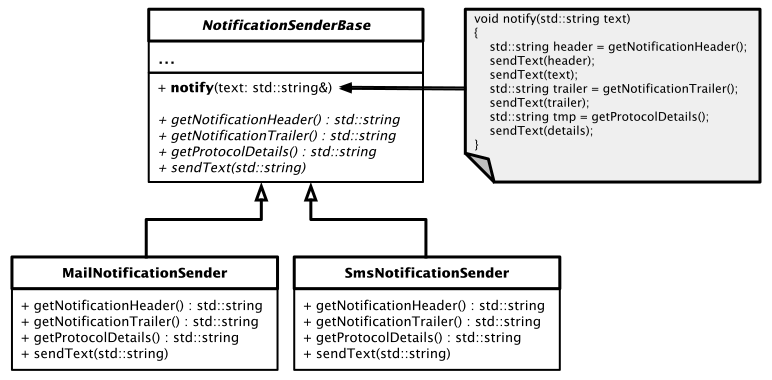

# Versenden von Benachrichtigungen

#### Lösung

Das hier beschriebene Problem ist ein typischer Anwendungsfall des *Template Method* Entwurfsmusters.
Die `notify`-Methode ist einer Basisklasse zuzuordnen, wir nennen sie `NotificationSenderBase`.
Die einzelnen Schritte könnten in dieser Methode so abgehandelt werden:

```cpp
void notify(std::string text)
{
    std::string header = getNotificationHeader();
    sendText(header);

    sendText(text);

    std::string trailer = getNotificationTrailer();
    sendText(trailer);

    std::string tmp = getProtocolDetails();
    std::string details = 
        tmp + 
        std::string(" - Length of message: ") + 
        std::to_string(text.length());

    sendText(details);
}
```

Wesentlich hierbei ist, das bei den konkreten Realisierungen der abgeleiteten Klassen
diese Methode nicht mehr verändert wird.

Das folgende Klassendiagramm zeigt eine mögliche Implementierung des Entwurfsmuster für dieses Problem:



Abbildung 1: Schematische Darstellung des *Template Method* Patterns im Anwendungsfall *Notification Sender*.

Die Klasse `MailNotificationSender` besitzt folgende Implementierung:

```cpp
class MailNotificationSender : public NotificationSenderBase
{
public:
    MailNotificationSender(SystemOperator systemOperator) 
        : NotificationSenderBase(systemOperator)
    {}

protected:
    std::string getNotificationHeader() override
    {
        // SMTP: emtpy line between header and body
        std::string header = std::string("EMail Header: Using SMPT Protocol.");
        return header + std::string("\n");  
    }

    std::string getNotificationTrailer() override
    {
        // SMTP: end of body: single line just containing a '.'
        std::string trailer = "\n.\n"; 
        return trailer + std::string("<End-of-EMail>") + std::string("\n");
    }

    std::string getProtocolDetails() override
    {
        std::string sender = m_operator.getEmail();
        return std::string("Server: FROM <") + sender + std::string(">");
    }

    void sendText(std::string text) override
    {
        std::cout << text;
    }
};
```

Wir testen die Klasse `MailNotificationSender` mit folgendem Testrahmen 
(den Quellcode der fehlenden Klasse `SystemOperator` entnehmen Sie bitte aus dem Repository):

```cpp
SystemOperator systemOperator 
(
    "Super Operator",
    "system@operator.com",
    "0049151123456789",
    "465565456"
);

std::shared_ptr<NotificationSenderBase> sender =
    std::make_shared<MailNotificationSender>(systemOperator);

Message message;
message.setSender(sender);
message.postMessage("This is a message being sent as Email ...");
```

*Ausgabe*:

```
EMail Header: Using SMPT Protocol.
This is a message being sent as Email ...
.
<End-of-EMail>
Server: FROM <system@operator.com> - Length of message: 41
```


#### Quellcode

[Siehe hier](../NotificationSender.cpp)

---

[Zurück](Readme.md)

---
